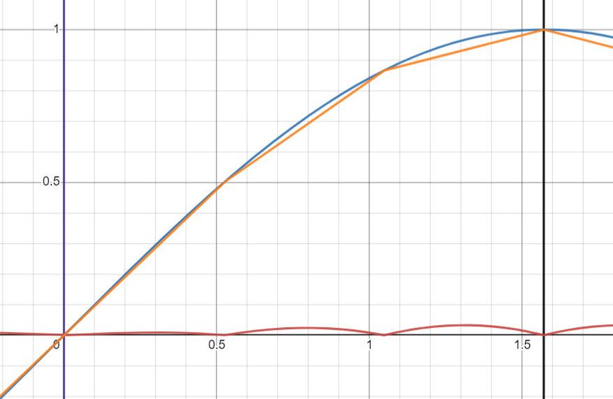

# Lookup Table

---

## Prerequisites

- [Binary](Binary.md#binary)
- [Dataloop](Dataloop.md#dataloop)

---

## Contents

Topics to be covered in this lesson:

- [What is a Lookup Table?](LUT.md#what-is-a-lookup-table)
- [Why should you use a LUT?](LUT.md#why-should-you-use-a-lut)
- [Optimising the LUT](LUT.md#optimising-the-lut)
- [Using LUT for Sin(x)](LUT.md#using-lut-for-sinx)
- [Linear Interpolation](LUT.md#linear-interpolation)
- [Conclusion](LUT.md#key-ideas-to-take-away)

---

## What is a Lookup Table?

A lookup table is a common solution to certain problems. 
It consists on mapping inputs to outputs, like one would in a dictionary.  
To know the output of an input, one simply looks up the value corresponding to that input. 
This is specially useful when certain functions are too expensive to calculate.
Here is an example that calculates 3x2 + 1, for integers between 0 and 5:

| x   | 3x2 + 1 |
|-----|--------------------|
| 0   | 1                  |
| 1   | 4                  |
| 2   | 13                 |
| 3   | 28                 |
| 4   | 49                 |
| 5   | 76                 |

## Why should you use a LUT

Using a ROM to implement is simple, and only 6 bytes suffice, when comparing to using 2 multiplications and 1 addition, this can be an option to consider.  
The disadvantages start when there are a lot of inputs. Since we need a bytes for every input, tables can get pretty big if the input can take any value. 
If there are multiple inputs, then this approach scales terribly, because you need an entry for every combination of inputs. 
If we have a lookup table for A * B, and A and B are bytes, then the table can take more than 65000 entries...

### Optimising the LUT

We don't need to implement the naive approach, there are techniques we can use to reduce how much memory is needed.
A simple trick in this case is abusing the fact that multiplication operation is commutative. The order of the inputs does not matter.
With that in mind one only needs to store half of the entries. Let's compare them side by side:

| A\B | 0   | 1   | 2   | 3   | 4   | 5   | vs  | 0   | 1   | 2   | 3   | 4   | 5   |
|-----|-----|-----|-----|-----|-----|-----|-----|-----|-----|-----|-----|-----|-----|
| 0   | 0   | 0   | 0   | 0   | 0   | 0   |     | 0   |     |     |     |     |     |
| 1   | 0   | 1   | 2   | 3   | 4   | 5   |     | 0   | 1   |     |     |     |     |
| 2   | 0   | 2   | 4   | 6   | 8   | 10  |     | 0   | 2   | 4   |     |     |     |
| 3   | 0   | 3   | 6   | 9   | 12  | 15  |     | 0   | 3   | 6   | 9   |     |     |
| 4   | 0   | 4   | 8   | 12  | 16  | 20  |     | 0   | 4   | 8   | 12  | 16  |     |
| 5   | 0   | 5   | 10  | 15  | 20  | 25  |     | 0   | 5   | 10  | 15  | 20  | 25  |

If we know that A >= B then we only need half the space. 
If we don't know it, a simple conditional swap would make sure we meet that condition.
Tricks like this with manipulating the inputs can help a lot. 
The lookup table doesn't need to do all the work, it can just be a very specific part.

## Using LUT for Sin(x)

Let us give a more realistic example.  
Imagine we want to aproximate a trigonometric function like Sine using a lookup table. 
This function has some cool properties: 
- It's a periodic function, and it repeats its values in a wave every 2π
- Its wave is symetrical on both the x-axis and y-axis

These are good news as we only need to tranform our input into the range of 0 to 2π. 
This can be done with a simple remaider operation (angle % 2π). 
Even better we can make the range from 0 to π/2, knowing that:
- [0, π/2] -> sin(x)
- [π/2, π] -> sin(π - x)
- [π, 3π/2] -> -sin(x)
- [3π/2, 2π] -> -sin(π - x)

Inputs to the function will be the indices. 
If we want to know the approximate value of our function for a specific value, we just have to find the closest entry and use the value for that entry.
Of course the quality of our function will depend on how many entries we store in the table.  
Here is the difference between using 8 entries or using 32. The more you have the better accuracy you will have (error of the function in red).

|      8 entry sin(x) LUT      |      32 entry sin(x) LUT      |
|:----------------------------:|:-----------------------------:|
|  |  |

However, this is not a very scalable solution for when high accuracy is needed. 
Because if you want to make the error twice as small you need to double the entries on the table. 
Which is a lot of extra memory for little gain, after a certain point. 

### Linear Interpolation

Luckily there is something we can do to improve, which is linear interpolation. You were probably thinking about this already.  
If we want to know the value of 1.25, and we only have 1 or 1.5 on the table we know that our input is halfway between 1 and 1.5. 
It would make sense to use the average on the values of 1 and 1.5. 

We can apply this but not just for average, but for any value located anywhere between two entries.  
Remember the previous table we had with only 8 entries? It wasn't that good. 
This next one also has only 4 entries, but it's using linear interpolation to give an even better guess than before.

On the normal LUT we were finding the closest entry, but for this method we need to find the closest entry above and below, 
which is a bit of more work but its definetly worth it. 
After we find the 2 values our inputs is between we can apply a formula that is used to interpolate between 2 values.

If fi is the approximation to the original function using linear interpolation, and:
- `f` is the original function we want to approximate
- `x` is our value, 
- `l` is the lower LUT value
- `u` is the upper LUT value
- `x` is between [`l`, `u`]

When applied to sin(x) we can rewrite this as:

## Key ideas to take away

As you can see, there are a lot of techniques that can be applied to help lookup tables. 
The tricks to efficiently use them, are: 
- recognise a situation where a LUT is a good solution (reduced range of inputs, speed prioritized, low accuracy, expensive function)
- Abuse patterns/properties of the input/function that allows us to reduce the amount of memory used
- complement them with extra logic to increase accuracy, or reduce the amount of memory used
- Linear interpolation for when the function doesn't change drastically, and the range of inputs is decently large.

 

If you want to check out and play around with the graphics that I used for sin(x) example, click [here](https://www.desmos.com/calculator/xymtcn5ksr)

---
## What Now?

This lesson is over, however here is a list of topics recommended learning next:

- [CORDIC](CORDIC.md#cordic)
