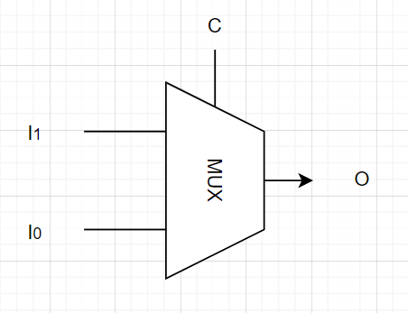
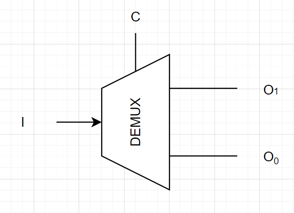

# Multiplexers and Demultiplexers

---

## Prerequisites

- [Boolean Logic](Boolean%20Logic.md)
- [Logic Gates](Boolean%20Logic.md#logic-gates)

---

## Contents

Topics to be covered in this lesson:

- [Multiplexers](Multiplexer%20and%20Demultiplexer.md#multiplexers)
- [Demultiplexers](Multiplexer%20and%20Demultiplexer.md#demultiplexers)

---

## Introduction

Multiplexers and demultiplexers are digital circuits that allow a single input/output line to be used to select between multiple inputs/outputs. 
They are commonly used in digital systems to reduce the number of control lines required to select between multiple inputs or outputs.
They are also often used in conjunction with other digital circuits to implement complex logic functions.

## Multiplexers

A multiplexer (also known as MUX) is a combinational circuit that selects one of several input signals 
and outputs the selected input to a single output line.

The selection is controlled by a set of control signals, which are usually binary. 
The number of inputs a multiplexer can recieve is given by 2N, where N is the number of control signals. 
The control signals work like a decoder that decodes which output should be selected.

The diagram below shows how a 2-to-1 multiplexer with the control signal C, and 2 data inputs (I0, I1), 
and a single output (O) is generally represented in schematics.

And here is how it can be done using logic gates. For multiplexers with more inputs the schematic is similar.

In this example, when the control signal C is 0, the input I0 is selected and its data goes to the output.
Similary, when C is 1, the input I1 is selected and its data goes to the output.

## Demultiplexers

A demultiplexer (DEMUX) is the inverse of a multiplexer. 
One can think of it as a multiplexer that has the inputs/outputs switched (input becomes output and vice versa). 

It takes a single input and distributes it to one of several possible outputs based on the value of its control signals.

The diagram below shows a 1-to-2 demultiplexer with the control signal C, a single data input I, and 2 outputs (O0, O1).

And here is how it can be done using logic gates. For demultiplexers with more inputs the schematic is similar.

In this example, when the control signal C is 0, the output O0 is selected and the input data goes to that output.
Similary, when C is 1, the output O1 is selected and input data goes to that output.

---

## What's Next?

This lesson is over, however here is a list of topics recommended learning next:

- [Encoders and Decoders](Encoders%20and%20Decoders.md#encoders-and-decoders)
- [ROM]()
- [ALU](ALU.md#alu)
