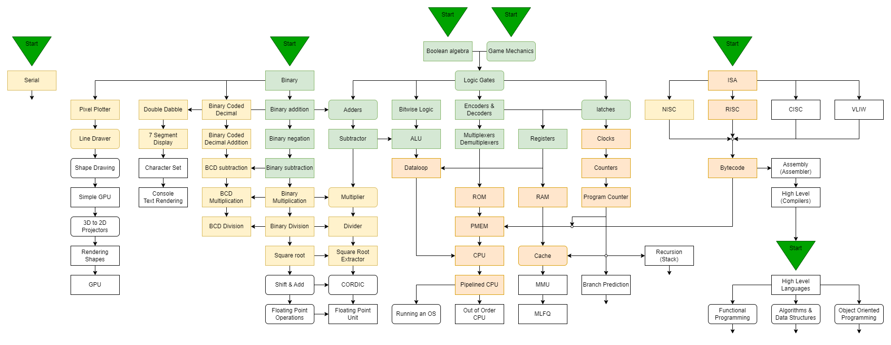

# UnivOREsity

## Introduction

This is a project created inside the ORE community for the ORE community members. 
If you found this, and you don't know what ORE is then don't worry as this can still be a place for you.  
More information can be found [here](README.md#ORE)  
"UnivOREsity" was created to make teaching and learning an easier process for both parties.
A lot of the information found here can be exclusive to how redstone works in Minecraft, but those concepts will be visibly marked to hopefully not confuse the reader.

We hope you can take advantage of this resource to help you on your journey, or if you are completly new to this welcome on board, and below we include how to get started.

---

## Getting Started

If you are unsure to start you can join the [discord server](https://openredstone.org/discord) and ask people for help. To fully be able to take advantage of all of our discord server's resources and channels, one should own a legitimate copy of [minecraft](README.md#minecraft).
Exceptions can be made, just talk to any of the staff members.

Because knowing where to start or where to go next may be difficult, in every lesson, we include a suggestion of topics to learn next, however, to visualise the big picture we included a road-map/diagram of topics: 

If you would like to take a look at an interactive version, go [here](https://viewer.diagrams.net/?tags=%7B%7D&highlight=0000ff&layers=1&nav=1&title=Lesson%20Diagram.drawio#R%3Cmxfile%20pages%3D%229%22%3E%3Cdiagram%20name%3D%22Knowledge%20Map%22%20id%3D%22mpZW8tcmo3RP36I1rnIO%22%3E7R3ZcqLA9mtSde%2BDKfbl0WjMptmcTJJ5mSKASoJgEBOdr7%2BgYIBukUjbB8xN1WTCIjZn3%2FuIb43nZ542GfVcw7SPOMaYH%2FHtI45jRYYJ%2FgvPLFZnFD46MfQsI7rp60Tf%2BmdGJ%2BPbZpZhTlM3%2Bq5r%2B9YkfVJ3HcfU%2FdQ5zfPcz%2FRtA9dOf%2BtEG5rIib6u2ejZR8vwR9FZVlK%2FLpyb1nAUfbXCyasLYy2%2BOXqT6Ugz3M%2FEKf70iG95ruuv%2FhrPW6YdAi%2BGy%2BpznQ1X1wvzTMcv8gHLuHx0B4vb97YsTZ4verPH11FDjhfnL%2BI3No0AANGh6%2Fkjd%2Bg6mn36dfbEc2eOYYaPZYKjr3u6rjsJTrLByVfT9xcRNrWZ7wanRv7Yjq4GK%2FYWT%2BHnj8X48Dl63PKgPU8dLaKjgev40UPZAH4nKAgiqEzdmadH7%2FNL8e78Fns9enw5bVwNry67l1cNMSIlzRuafs590uq%2BECaJL4gAfGa6YzNYX3CDZ9qab32kiUaLaG%2B4vu8LPcEfEYbw2HLcrvTn02EnisbcvT%2B9vne18warItgqj4u55T%2FF0A7%2Bfv5CS3D0hYjwYJHEyg74205aRDGKh6EMhVK%2BZZ40%2FnoXV%2BqspQtnQuPPidBg68R%2F%2B8eOyEFhJ2%2FZH5o9i77pxHK06MGb2fBzZPlmf6ItQfIZKMY0%2BAeWbbdc2%2FWWn%2BUN0VQMITg%2F9T33zUxcUbgXXpLyAP9her45z4VUdFWOFW%2BkiFk1Ov5MqLVYW48SGk1g9gRcluNBiD8SeOxOAi%2FFLl%2Fcs3eFJRVUWGxsbtDnIKyBISl1EnD08QWmjS7nt1cNt2HYzbf27Pe9PPqn8g0WRh3tYIIQxQwWFmqlNJG0URMxmmFYvuU6B6CUOJGiUsLLK9TE%2FhHySi6qX8AEVt6ycWzhmEPtQNiCZ8FtNRYBNAJX37M0Z7hkiC1A9Vx%2FhRq%2BrTIokBmmGfzDAZlhRJmJCT9xfrD8IQN8lpHFFPQxMknCwF7Zn52MwL4f8KmPIsCc%2B2lApwHouI6ZgXZ0SrOtYYgNPQCbGZw%2FCcFl6ZrdjC6MLcPYiNk0Q%2B0DBVIxFPD7QoEKEiZLSnehlHRn%2BYLina%2BWeGdjdVN9gzSLLPoxlsJI3oOPGH301rWCVa%2F5WOXSbLyO6sePWC01%2BlSGVtbLKCM5Yay5UhEGKAuwuIwQoGSELQ46%2BmNHuh%2Fcmo3PxbVsnjUbqCFSYYOdBnczIiX8PExN7%2BblNUy7cYytvZj26qNdd2jpwakzzTenq6falvO2umhovnbEN5d5N64TYJZr%2Bfxv1fnjXQyU%2BcvwofdrwJyZq4%2FlczefeK2IUrBmPltRM59dC2IKMdngMIGv76QIhToxGEF5iHGJ8QDioeQhNm4lgaKLTSFra4CcLHqw8OCqZdHmRCymsxff0%2FRDCVrI0EELTkFgjfKGYzTDMpHgSLe16TRQXJlQRRLuSelCJAq9lSoj4MZ54kV8yKDAFTGwjc%2BVNOQVjjtWOPXrJ7UaTmaOmeSPlH7%2BChiIlf%2Fdb1HUYzX5I6S%2FZYMv8fUtX7BLf9AdDKZm6jMBRWiLxB2T8AnTPPDw6aWqqVKc4I%2FVE8k6N3xtkjXwyjz2WQpYz7Typ5us5%2BCp%2BqiQ3SxoV7YpdxXv%2Fo99Mn%2FQVfY2qkzIJZwVLOpsN%2FMKvbRREbsZD2a0eISw9qHvhBZmI6FoHLEa%2Bo0VuEC5cFkhTkSr4Z7NM9R0GTF1w4D4geRi4HzhFCc1FYBA%2FqnX0bpPA9nTF%2FbH%2BV%2FXe7jr%2FZQAFw4%2FWHiwUNjJXXZCzJ86umuYXqDCA0KStHGoM1e%2Fg0M7TNG9eMFfw%2FCvthnfWzuHDwlfUa3eOJFGD92759mw03%2F%2FN5I7d9c9v1GrUNUuaYIS7KUWFX%2FEw1k7%2BVQsK2eCoyIFpyqGUjI847q2qTnh0u2h%2BeJpdWRVRkxn4lgeOjgjoHKzZbv6G1lJOBiYkq7jwGvI6gtDql4h65DAF%2BwIFY59CUUtMaFoDWZVvIhsCFTMoLe4z7ApmFphD0FAZWcroCCftHUDxdPg8eyYmgB4uq4cKGTJf2cOFLLFZbAciM1ECjCuYhwRXtuuz4kr26ulSnZyEncHNxAEL6UJQtxfMRO%2BcfGHxAFihG7v5AQLBHQ0UZGlS9bvnF6e98XXWetcbsBUKu7YmEYWPerzSHUt5vryYXTef7p6lezzCfm8%2B25uZFaOizJZNxJLC7BNb9RqMHC0sKGOV%2FkZ1JALpoTdduu5Q08bBycjExkhmBpayALNoALWAGJhi5%2FgxlkUrVVjadWGFuQMNAh0f9OrIy9kY%2BFUeQELW4VDYdusJWzX3mF1YMsjsEUFD1B0LcY7QaVcEeeeZxDnnkyGHnmwWilff0OWulb%2BIMFethhZWwk85oSKKDuWB513UiY8A1DeXRjLLE%2FcpimYkUSCixvExLe9lKw84qnUk8ZfmjQYzKE1JR7Ap5TzzJoNVJNy2FY1sS78D9DexhQdycdyxGMJ5cQ6g5sS5n9aUzM4GfXC1Y57VDXNPPCTWUCUJ8F2stjaLqDQaBH4phL0uEwtfPsUyKX3mRtfaEyXcGkGN7DcZL4ETnw9rm5rafrIjJ8WfPnqgatrq9XmFri%2FP97%2F%2Bjt5EBrXt91p95ExTt6s1ce2TA1QEvAqW%2BGeMVyr4QKLVax4Z3FeMP0SYQDlxRU2VjnizfN4G1JlNxg%2FpbOV24TGdLIslttdaDSNVUHsWmqsnlhYavxrPTdcRZs%2F%2FFl8%2FJ5enevKX72I1EhMZd631KCjwxWJng7fub1cganZpWgUE7QhYumxvScdzEbGOj4wgQ%2FquXEsfurhxMQrTw4Zi9rRA9FUP%2F8lK%2Fvgnf9a9SaU4YHifk61kpHrlSd4oNl9qCHxZ513qsSPzzuDDNArp%2BW%2FpzVIDuLChMLww2qrxT%2BYjud2YJ7bIbpIMhEdnxthIpr139iCRxDvugwdYzQBvpKzYnSM6oFer6QeIECQSBBIoinW8Yg7PKMmT9BuJ2SwUWB5y0425NyStWeAqqv2Gf4sBloOxqChGYLILSCsrm2Su%2BxkCW7vtJbVcEilIc2NfPCZORDDBJ4XuKK8ENcrVoQZYOuQKjsVuSSO99OH9u3aISU7lIMlWzuEf%2Fla2YEA1BEPIqcvAaTepSCzwvz59cm7VRRHmcyYCnuShcGMfS8wRzJ32Qmj46LfrKPNIQlpoUJ180C8xAGd7A%2BRNpyGe77EHQXRvi27sxSudQ8P6GoZ8iJMDSW8psGMb8pFbEXwFa87WVR80W8dghCEL4kUgc2uchmSXYTp7gwU%2B2B1Y6B43QkGuibPQANuAwNJL5JIqiBfZCvHQLXpyNm1A4ecBuKLWgxVYyC0%2B75VmoFIsIMsV40dBNg6rZKkTVmfYHJClFrudwsMSZl8tkgjMCSxoBRFo4ajHHUUHpROSVhi9ple%2BMsZxYQtDhCTnWoNBx7faJ0lyiG2bU2m5nagatPJstq6PbDmISJO0jXqhcn5OzNfRPk4uz3u%2BkxyDgAKU3FPIJVAopnwIQHcGFX8jWC1xrnrTpZZTqfm%2BMVeoPPR%2FxNdMr3%2FVs9igy8Jg5l3VLWO4lyqT7LHdKJ67auPfwNFtixpIL3dnL2vi5j2Pj8gm5oTs2RBboJkLkQSjHce0Ghwpmt%2BmOHH%2F9NyxxMrYLZpBbkNfrwYZpBbrZS3pGSVN88BK2%2F5hypvqXAnV7WiKQpo3m232hEoJ7A4jsGqA7A7psJML91hX0GyqMHComIFvaj3uN49tm19WFPSW8fSyQxkt46FL2lUDn%2BQaK622SqyFLDePexyYoL5v1oiieNqla3KqPXdf58FAAhX4Lr%2BAQg%2B%2BL4G%2BYfW18h8QaaQiEcLyikqUGOtZoKvKI7hpmdgbVCYnSWo2uM41GBhUS2zQ0bnQK%2Ft8d7M9q2JbenBOg7DKqcZf8NGu4H2N6IeupaL9psKtCy0TUO%2FWjf37YuoliZ3KJd8wYn2Gye8q0%2FiP%2B5NO2s3P1Yfy2cwKfE%2BJWdyEWCJ7FSZfXZg7z5RC7jmAsyEwyR8KhZuy113ctxApDty94UpMoYOQm9kmQQ%2BbxMPgv9xHFG0aaBqnj7aNBBGNw3i2ySBsAN8cBN4HB8UO8RUvl1BVKvnKV43LvB1vwx8MafzfYzqg2EQ%2BCCYAupx1yuoohRtgYZjKqzrBNRASt2XxOEHD5Bv7gbFppg2tvFK1kjJmS0FZS69xROXfuDWfZmixzYyoYy4K3H%2FWzIraA94f2QNwrUdcZI2DgXw6ndwpmkYOfKbjoubjfpUYMgYAsFet3NXTtERABQ6jg28GhQ2UEy67Qb7ivvZR3Z7raZccPv3HeRG3nsma6TtoetZ%2Fmg8xcmObN10OHgzuK%2FvezPdn3lm3g5OdAQLUs8Jzy8wU2l3J37yO55voP7sNslrVNHa6x6V%2BSee5uhhrfKtZxqWXj6nQoKkszsgV0BZ1qpwqQQrYBKG%2BBvBMoZ4FQ3bcb6Ta1k5nMq0OjaYrMri1GNRVlRB5iVFyD5w30IRTTbfWhPTtpyANDjmQEa7VkCEoi7bzSykCncQ%2FLrxlmHorL1VGvp7gSW4hcVxNbOwMD2V%2BBcDy5hgy2LquL8CNbWCwSkWiGBp4dxl42qLWm6IN9TpM3VrrNmE1QCNHICU2fGY6iwUfGdtrZJku3MHbutCfK1RteL38bqTOWJ39mKHSbG29rL8o3ZsIECOBMKD%2BfDSJPj3LLpXCVhpMD5pU6vByxTQw4M17OGXU6t2Chr4AWtnzl335pEIXc0ZzrRhbgCdknuHBNDBXWW%2BNm7H7qS9p8H%2B2we0yZx6rCZ%2BlPQT9xxtwoxN7MycZdw99DCyrset5w49bTy2nGEOo1DKNGXHfsHHQYC2SKHLKMRV7wZGUcVKMQoall13Stx4VgDGZXi2UgyiMlVjEAG4aSFlJpHZIjq3yqo6rT0FqRw1lDq2G3xxSM5MxFxZpXAzMb1l9xt89QFS1gRP8WgAYztEHxyrZJ87AVgiXVDgsJRg3OBahL%2BFos2EYrUkjoCOopWDw745HJs41mhb04mtLcpxRyWiflS368bzE4y5Sp03YpLfyhtStcIWIqo7WiMt7AAJc9MBj8ArCYSowZVEvbYOKkHUXFGBDzbKJHfdqfqW%2BTIId2u7vl%2FL7j8%2B23kAntERYarE6bMBZsQf%2FsZqJTZFdMZf13KWaU1P%2B6xlR3iWCeANHPGHpDXFwsZ%2FtfKaImr890faJOaCKgTREKIGN3AkmFlg9Im6aAxNAttcJXfdSaK2xpNlycpZBepHsxQNP%2FApdruSfo7rTN0QZFn%2F%2F5c5D0Pu92YAMy9fQMB4QPDgjBd06AJCKlrFK1Wr5FNCSz7DX0wAUY7h2tisa5hpcj34ADsiPGiOOcFTO0wQqxZB4Zjwt7faVCvwFa87uZ3wl8BnljYifKVOlheoTjTJRWMCblW0OOArmmTU%2B76fOc6KvDQn%2BHXTB5e1aqZSiGoCTn0eqa7FXF8%2BjM77T1evkn0%2BiWc0VLDNB7tcjrRQ21CpIm6aF0m%2BNiXvPVPSUp95q20ikK3W%2Br6mv1Vg46fsPtFUxSd2izC0xAeBku9ZmjNcEvYWEHmuvxoJzLdVBg3JMUyTX3ZXIiE5hhHl5ZVwelM6iBf8kAG%2BnKmtYjESWcKAXtkX6FF5HJCph%2Ba3%2FND9S8E5DT%2FHdcwMsKNTmm0NQ2ToYalWcP4khJala3YzujC2DGMjYtPcsQ8McMUwkB1QQgwDmGEMh0r9rCRVjPxZVIQfOP2jOABngJ8j%2Flk5u0s4JmhFlwF%2BnAJAcSDQYwB8dzkC7AqHDXcabYl97YjLq7snRd6qk23jrXb4urOX5YzYem5GkW0Qp5pty9sZEIFzjffhywKZagwXC%2BRatbeSkzyYma3V2p0yb9UIR9R%2BJxyEL2hm8vAaGbVAf2JuI2%2BMy1bmIR4ELIVRNLFReNpLODfYOhDWoloaJvUuBZkV5s%2BvT96tojjKZMY0YOe%2BsCkeIdOIhn1NFuWS3D3vCcfKm54X9mqsb5iEIfBp4snbmj7j1NEXqleP3DV%2BngekBFP%2B7l48lmMzAkyD9G9SrSo%2BkUYP3bvn2bDTf%2F83kjt31z0fAykESocSIuEYMQV8DOz3FSHBgv7nRQizGJDoxUewGABpLCkk%2BrHLpdWnz2YK4Fg1g4AN2c9v6wbki8RSumHTZodn2jgs1eyZ%2BkhzLD2qM8nd9nDQbpz9nT3Orv22Yl3b1zfvwnz1sVyC4hMvGxEgoYJ%2FQzQVQ8DJToV74SVCVh3LKmkOZffoMR0V2Cixo4mKLF2yfuf08rwvvs5a5zJMcKEQ22KXS2kOTXZbi%2FUx%2BZqFvNdMqjMzsBzqONWSYzYIQBpmGha4qK1wqGYal5mFTDOTiwU9Gi8%2BcDMNwQDFPC4WA2h8ElUAtm1NpgVoX5tOltqmPbDmIdBO0kq5cCj4GzpV4OTjjOchrc8kYCqiIBXLQ%2FSp19G6TwPZ0xf2x%2Flf13u46wHHSvYRUcS%2BJiZW8kvx7vwWez16fDltXA2vLruXV%2BvWWvohxbxlo%2FsKm3Mz7BhAA4rj1HWC%2BpaW2ZkROfuMJgaHXrj5ZsL4CaAw6rlG6C%2Bc%2Fg8%3D%3C%2Fdiagram%3E%3Cdiagram%20name%3D%22Game%20Mechanics%22%20id%3D%22fD-G_uWuNtD8iNlNOq4x%22%3E7V1be6I6FP01Pjofd%2FWxtj0z7VzOnOP0tJ2X%2BRAipkXiQGy1v%2F4kQFSIWloJBJy%2BVMJFyNpr752VHezo57Plx9CeT78iF%2FgdTXGXHf2io2m6ZpnkH21ZJS1qr99LWrwQumnbpmEEX0DaqKStC%2BiCKHMgRsjHcJ5tdFAQAAdn2uwwRM%2FZwybIz37r3PYA1zBybJ9vvYUunqatqjXY7PgEoDdNv7qvpc83s9nB6ZNEU9tFz1tN%2BmVHPw8Rwsmn2fIc%2BLT3WL8k5%2F21Z%2B%2F6xkIQ4EIn%2FOp9cS6HL8BR%2B5fj7vPS%2BGl29fTe8Io9MHDJ86ebKMRT5KHA9i83rcMQLQIX0KsqZGtzzBeE5qRRJY0PAONVCqa9wIg0TfHMT%2FeSGw5Xd%2FT8DybbvE8vF29cLDNbq3SLf%2BK0EyK0CB1w4DFTK8R26AF84LgUO9oHW1%2BQ9udHgGaA3A85IAS%2BjeFT1kbs1NS89XEbNMiHFJA3gGP8AWf7uIFU4KR3%2FWT7i%2FSbOprlk%2FsfThDpgW3YrN8LxHZ0o7jjz8gBqjVfxh3H9pNPHv3%2FL3AjjAIQu7XZnHwKcMSuTm42%2BYLkWM5EsgbwPIUYjOZ2DMAz8dFZsCfQ98%2BRj8L4XN01Qd81SHuEQ%2FQItvb0tbFuWYdgfgIhBsuDwKR7u2vnngaFrjVIG563XCzzm9Mt72opgtC06qDa%2BynTK0gZ1ZSKMz1xnBnaEXTIAYu5a2PKHBS6IGwRaXQrTxq1btL0TyM%2BDQqSTetLRbaBOLJ9tGeUYhg6j22KSxzDtLoZxijeDIqBJcR3W5%2FvN5cgW5uT6MbxtFSL5o1q6byMTz0LQ3u1dcAcwThNW1%2F5O23YMq%2BBkrMvU1FyFpJcc2Mv65s7woTUJplQFeZgSeWmVa1J%2BEhKcXbFyiiegbwMljZqrM%2BsQJXMCkpn9tscfSG%2FzsUFtZ8LC%2Fogl04kPZSedpTtKd8%2BK8NROLi9tpWHq5tfd%2BqD2v0TIHJmpMsVIAQqTTdstDwPIQohXlWRzU8mE81xdmXzrjW2TGEDZlOvPZ23xEH5xfao6jHHcAZfiFmioEVY9vOps2HWjmXvRNxmv6DbNErPwY7Dpy%2BOaxdgvPA8GHgbzwlBJUpIRXwb5H2nBHwbNIlv1Y6T1jPjr3JUqzdD3ihtefvSKpBCtEapaVWYg1zTQ2tHJcBlfyIuil4AegS7%2BEqkXz3iytrjtM38tGr9TlurRdw6gjl6QeawoYQszNHFMecnCFEnmewh%2F8Z0nrVNqQ43TJSANYY4NL%2BHwIERHfK7xDJXUfyc1A0qMIiwXVGhSTXYDuRD1mxFBlJy%2BsgrqHqvmAS640wzd2biyssQT8fffj%2FPX55%2FzTx0%2B20YLSej5e2piKdMWn89MMpVQqkJVNyuMJiR%2FVcXsQqAHBBFsSTQFvfJ1UNI4D9PRHTTiopuLFWQhW77RbdobgclZy5roiXXbizR8nlK%2FRMVWqPEtvfzjHX062FNrjlBdt9CRgiQFp%2B3ckDAD%2FbWiWZtVNNPJIPUi0orllz1WXotEtbR8w7ruYb7zqZOp%2Bx5h%2BKYlp6mvG%2FeQc%2FPO6hmbtHcW894pbiHy6HX1T7lF%2FcchEi8MtjKIRAXMLTaV13ojSoVPMK5FF3kZMolOejt0PhKxKf0hZvvK8tk46y92mHuADGT0HotSw0lNg%2Br6trtPZGaBfbN2MB4S6Q3WCF%2FPlEQoEQf7HCRqytxaAfRDJIo36ryQglHhSeytpIVDb5eqiJZkG%2BUQFZtNVpxTGtODNaeX3mT6y%2FLYRu1lKNVgCvrTUm4yu5bTDkFnCV1wK0rjOFqgOuPiqx8VUiB4GhEdvvIo4lOa0C0JASxUe%2Bcqjh0Fl2jZpY%2BH%2FW%2B0MkVcjO7KSiPGpx9KtXqo0YtaloVFiJGct8BoZGXuLVqB76GwAWSQ0hnQjGVueMA0ZrAwBWLa7W%2Fg8uoWRnLhIVNlJBips0oLLaKCQw87ddFKsyAxK1aP9gjIkqN6GIR%2BvIwmtSnq6Nn2Xmthlcc8cm9BPQ%2FFcmr6PvETLkW1LL7FkU4sn8Sgt8LEDirVnJOVeWLuUyqEQGqqnx6oZ0G58CH9G2mrUGSex2BBEDuF7nEsHNHsUfTYd1B0NqrPUztNKKiWbSUzJRrzbIpsL4qkST5QNj0sScnSkpAM4FLLhMYx4u21cbxEkL9MAqUghIYXeAgt104cnRUa19%2FYp5IkZRZuEhKKzvqvUvv52qkGOX319RlDxAzk24KLH36kSl5ookvRg7y28P%2F%2FOozCcYyjVKCqhWCzaLqUfke4zhMBapHW7%2BXQgVbl%2Fx3pnYQxL9FZbtu2LqRqnzqLbtwMzj7fv6xauWmRGy%2BrPm4kM19gd7vfRhs%2FbEUvKZpIWu%2FDnZ0KvB14WMYI%2BZA8BRPELW0IJr7hSYJHIwmOMfbYAqcaUA61mvT25DlG%2BNZjaoDOyJiGEUjRunl0MfhI1ASG%2FooXjNKGBdfaXNE%2FG6PzAltYSC3lFQCCtayVPEIKhV9C5Ul12oRS%2BBbqIY3F22qOucyDwlYIrDS6Cp5xwq1RBv68VOGbZop5%2BCs%2FRViVqPEpSN8ZVGhiC0IkMVX7heKjveVl%2BSk1q3x4H%2FopG6OMZMSh2ELp%2BHyMFYZ985t8%2B9HfHsHEPhvbt08Xr9cf%2B%2FuUlJy3eqRfp0Xf3j6e9ZBABxsj9kVlMOdouZnJ3oW3y19Qb3yT%2BSb04fx4xNaDK%2FO768Xn%2B9%2BdHfJELlewSG0Ay8OHK9YWohw8lM9%2BsVA4S1PUc7oepgdlqcoZi%2FeQ60%2Ba6vkb6dFHsS4sJly6RkPh7UDjvxbj0qDgy%2B%2FGZGIh3lMwBJn%2Bz7bpwGdP8gCkDbZPvQoQA7pSUDah7SzoGP7Z%2BmOGXTdvWBnHY9oVF5BQX87CmQzRNQBb0Ra8mDTr4gM1Enj%2Fw%3D%3D%3C%2Fdiagram%3E%3Cdiagram%20name%3D%22Adders%22%20id%3D%22zCY-o8axUZyvVsKHc8_c%22%3E7Vpbc6IwGP01ProDRBAfLb1st92HXWen9TGSCNnGhAlRob9%2BgwSBYq2d1UIvztThOwmXnJPv5Au1B7xFciVgFP7kCNOeZaCkB857ljUygfrOgDQHbMvNgUAQlENmCUzII9agodElQTiudZScU0miOuhzxrAvaxgUgq%2Fr3eac1u8awQA3gIkPaRO9I0iGOepawxL%2FjkkQFnc2nVHesoBFZz2SOISIrysQuOgBT3Au86NF4mGacVfwkp93%2BUzr9sEEZvKQEyZ3M%2FHHxmzNf10upz8IjdLbfkFzLNNixBgpAnTIhQx5wBmkFyV6JviSIZxd1lBR2eeW80iBpgL%2FYilTrSZcSq6gUC6oblVPLNL77PxvdhFO9eU2wXlSi1IdNYesWYj5Uvh43zj11IEiwHJPPyfvl3FQuYEm9ArzBVbPozoITKEkq%2FokgXquBdt%2BpRzqQCvyGnXML3Wq%2FaxuqQNaUSch8r5yPC2FUlEpTRakVZ06qajZMUntL0n%2FW9JBtyTNr7uCdKnv9JtEkRJO1QyqQMgeBCKERUP4uqzrkEg8ieCGorUqdeoSzgmlHqdcbM4FyMYuGig8loI%2F4EqLa82A4%2BwTYoWFxMle5nQrcPTqrWsrc6DjdVmpmIbGwkqVUvQ7OtmjNtOnTJlppaUr6WMdmD6gU9ljfZL68FB1TLdb8jTMzdOeRjl%2FyO4YYoh6lkPVoM5myuScIDsaH93x5vO55fu7HA85M8c%2BkeNZTtuOB15SAKvRpesQC%2FwB%2BAZW23y7n8OPBgf6kd0pOxo0kuEWIoZF%2F5LEfpg5zgmM6AjTfDtdi2nutj3N7QaTNzwIcH8iOcPvhcZB6%2FWo86w7x3B1Gh5b8WkLPFkXjbaZLzb2FeqvWSyhGuJ24%2FVR2B%2BMOsf%2B8HMsk%2Bah66TZsRe7zZWyMCYPMn%2FzL5T3mg2O1blsaC4DQBI%2Fq849b%2FwRKG59G2S28%2Bbn7Q3HPdBwOvYS1G1kwFk2%2BP7NkgXH8ZpjVDFPy%2FC33G3GCYhw9HA%2Fgswwr6PrR1dMd7w8bpAkBYEs2MznFxgSXCqpOVPhyGhah2GM1d8u6zAMe7hpmXMm62ajPkfa6bt17nc4irODefdUzDfLx4nKOdmkHyeyTnOdPpbtl%2BpcawhSEmRa%2BIo0NfnBWUYW8SEd64YFQehZXeu5cQIBhocJAF4vgArLXx1s2io%2F3QAX%2FwA%3D%3C%2Fdiagram%3E%3Cdiagram%20name%3D%22Logic%20Gates%22%20id%3D%22t3V9nZrIf8xbgUMTf0Ge%22%3E7V1re5u4Ev41%2BRg%2FSEhcPibpZXu63facdLftfqMxsWmJ8WLSOPvrD9hgg0Y2MkYX7Ph5dhsEyGZm3rlpRlzYNw%2FLt2kwn35IxmF8ga3x8sJ%2BdYGxa6H8%2F8XA83qAYm89MEmj8XoIbQduo3%2FDctAqRx%2BjcbhoXJglSZxF8%2BbgXTKbhXdZYyxI0%2BSpedl9Eje%2FdR5MQjBwexfEcPRLNM6m61EPu9vx38JoMq2%2BGTn%2B%2BsxDUF1cPsliGoyTp9qQ%2FfrCvkmTJFv%2F9bC8CeOCdhVd1ve92XF288PScJaJ3PD2Y5rENx%2B%2B4Nf%2F%2Bfsv%2B69%2F3r%2B%2FfneJymkW2XP1xOE4J0B5mKTZNJkksyB%2BvR29TpPH2TgsprXyo%2B01vyfJPB9E%2BeCPMMueS24Gj1mSD02zh7g8Gy6j7Gtx%2B4iWR99qZ14ty5lXB8%2FVwSxLn2s3FYff6ue2t62OqvsgmapHTh7Tu3AfbUpxC9JJmO25jq6vK%2BhW%2B4KSCW%2FD5CHMf09%2BQRrGQRb9agpWUMrnZHPdloX5HyUXD%2BHoet5fQfxYftPvySS6K6AUZDmSWHY3mfk0jbLwdh6sCPOUI7rJuJ3E%2FBWmWbjc%2B%2FjlWdsp8fBcAb08ftrCazM2rUGLWLIo5r5gYBdtiCAGPKMwQAAGrv54dZzk30dxfJPESbq61x7T0BuTfHyRpcnPsHbGw99tx5GDlY0t0YcV%2FIKVFjvQihViFFaQrZWjNX5uuTs0jjpmcZTo5Cg6CY66RnGUAnv2x8fPJ2DPkKPdntEXe9ai1Vqx4huFFaxF%2B8mncjWhIWR2gEr6%2BL8BaiRsG%2BdhOy8aqcUqt2KlSh4aghUXYOXrIMFCfNPA4kHH6EQifU83aX2OzzlEoQUaXjtlK%2B1U1wfDpC1QCNppi%2FVmM4y2npv1s1ZXExtlPjdyucXLu4d5%2FDxAwGzAYIwFrXhd1%2FPRqVBXpToK%2FT%2FvL6%2Ff%2F0J%2F%2Bx9%2FTL%2BEb5zbK85iHCBrlkbBbLLSQy00TZMsR1syyw99C9LYsq7y%2F3g0tizqrs7cJ7OsNn6%2F%2BvTkwHgM7SHpHQ7lPVmUh2J9m%2Bu9DJI%2FXGZNMjfJN0tmIUPrciiIo0nBi7ucaGE%2Bfl0QK7oL4qvyxEM0Hu%2FkaxNNEhhgizHA7oEBzz%2FdD%2FjH5y%2Bv6edvD39e2s706%2FOlVkN8UBI6P%2FgUplH%2B2AUbxY0s97F7z9KUt35KovynbL1aJl4gVdlJNcXayJd3Mazc%2FIzu3IWKbRV3OcFDIdyz74v5hoo1CVhMg%2Fma%2B%2B3arg97wBIJ%2B8qUEpdq%2Fnliond3ko8JNhohjjei2CcIuQ5xLeo5SiECLRDEh8UZ4kSCFW6WioBjs5TUDRxY0AGRNBtfFfV%2BWwPdcJ2ErG2rhNaen3Kevxo7UpARZsjvMcp9jTgguXAiVgGyE0mGAFwkOCu2kb7Yxk4kmW0wX33KbGNTr8TLzYbXjXPEap9LMvNgSvysmEd6ZB5nLtlutQWZNRwPcVFE2Ixk7RSg9kiq95pSsVCKsl6MbJ7DWIq7iKU5eKJELKEgzQesChUPdqh5ayu6PWr91Dxvl9qxGMJ29c3ARLK1BawFPCe%2BUacnvoGJZPPtvGIh1i%2Bjvj%2Birr%2F9dOMi66K1TCubp%2BcdKFEqh6f7p5XNU5H4KY6j%2BSJsdxyCxXzdk3ofLQs291LPwmpEt7QIjUVOKARIliex6W99iVkkFOmKpbpVxyyckgyzUEKoaSjhEGg4KDkCEbYaRGCG4Y7n1xd%2FFC%2F9nHdw5Vq9OAasy94yrWyennfg5ThSeNoyrWyeCgRlqjNFiNAmhSqG6soU4U55N16Hg3JSsjZBNyntQTsB%2FbrKdu8ttmKOgetrdAxsHpbOx4h4SIoRaZlWNk%2FP3Nlz5Th7%2B6eVzVMBZ0%2B3Y%2BBymufVWjOe9ySyIMftdtLtHOgnp0g2WWvmEbGWVHNOxeb1KH4WkkGGruJNGBIkz3M1Sx7B52XBGDn2LX%2Fk0OMtGD1oWskWjGjd2OSQUGOnuLSGEERTbtFH1siyCfGwSz0HW65azorEECbZCd%2FSbCcoggQyEwv95t4pVoMPyqzgelaOj9qHmVAyPqqnrnsF7z58%2Bv0bEALFFXXsQrd2j5OeVzaCrV%2Fw8F4x7Vq%2F0DKtbOkfjN2Xn2Kkve9MJqb%2FHF%2BrBMCw3Ej1pz0bT8%2B7fMtFUtRfy7Syhb%2Ff9pftJi3VQU2zddmkpb73Cr9lTlRn6REax%2B1FaNjNChzXUismMHMExURr%2FRJLd09zDOWYTjG2w8JxNFOsEunBqiLXOPvFUz2V2fGkKCZXcWFlRfPBwMxVWFh5Y7m3l5Pf%2Fvv5zdOnT8uvbyZffl1XO5EMM97ZyZB6bMN9bEWpHdvyG%2BxGFmmUT1SGtH947HvqIe6pgQElkbr4h0tMLTs0dZf43l%2BbsSOYZ9iEq1oARSIOq0lgf8XJbFqGm8T2ORv2ydq0jEt8Lcmzzkkvvj1UhBNPM05glgt6AieDE2oYTmDmDLqpJ0N8zzDiezqUFO%2BFTfs3OD5ChVlqVBhC%2FgjZrm%2BjcjVfs0rzh%2BWQKWMT0cwXzobt0Hc%2BGXWXo8Isfaf3HbX6QvzqXYvKY3zkEo0xfvXYJxHkIxumx5QG%2BdxdkzSgCSS6u%2BOC88asQUZCrRNZbNJ0Rxa7N%2BSJdLJ0Tj7Hwfcwvg7ufk5W0rTHLq62rC8%2BPfnvzogyhHVcgEoKQUl3S8JxmBRpJVaByWpFaYTc5jtIRrhtWWl1xNq6PlFeyX47zBU1EgI3VBSesJ646Fdj7AQV0xk5eYPn2mXz4oLFAT8aleVBW%2FldT9mvIhHZ7KqzIpGoKhCBugLr1RVSu4LUkhJVBaeaSClSG6RU7R704qc%2BlSvnRYp8kimqoGRjzn51q3%2Bsbu3d0ZJaTCMT1AiC2tcKagxzMx%2Fz2DAucjGLeTBrENX55zEpThTvQbpcrAB6lV%2BArPlyRZ%2FqfP7XpPx3PdHj92rIqsbyX1sbro%2BuvrUaPtUsEfZZxApGutLSRJtnOEISvJFdfHaIA3rhMu%2BN7Wq53DU7ZELPuQNA40HlqTQ9xN3ch7VEXYoUYUjpdgsptadhsSfoLFWkM6Re0nFY7Fado4f6VC7IarIz9RStOuwKHHK8vb8M3lD%2BMqnhbc%2Fb%2B%2FUl4v3nc44AjWiEYTxoLNz5hSIQN5zJZEHHKgtzxaFjqYDOebYn8mnhCIr%2BkTLtAicOi6nv3pguNR3Yg1%2FmskWfqMoV6apqx7y030AWQSlQRboXQTEv8zdUaiIMZVMtNUWyV5LdH4NcHSS6Hm2Wp4Mogksd%2FoidSDjvaglNJ9nS2DAbaJJodguBjxBNMkjR9KEoOf6ITSGL78sFVgSK6Vy1NYS2SGPfGSlN4RUos0STozURpZ1lk18JoFw2sdGyqVxr%2BgOVTQxl0%2B8um8jjraQql00tXYq8QH%2FTAbERZZk9EES0%2Bf7Ydkd25R0rTg5wts9%2BWcBVsLRHQLWpVaozXUt7tpbcoAFQV7SNKeC4cqjDPODLCv3RLzozDsb9bqt2rDdJvKY3ibxO7mS%2Fqf%2FKurcH5qLFzWpcTJq7mGS7ozWoiKaMUIn6mtRzwUzKc0cwSdyzdsLnp52wcdoJJq975rJ9dly2QVmTbi4TkTywjq63rsXfO7nUakF0BpKNHdmwkDZvn9eymZkkd8URkcyticXaFBZrW8QdwbVYheXaQq8aOQlgtvqAtui6ofHxYftMopg9tOoJflGz%2Fu%2FgG%2BRUPcl9ZYdEFUI4vbN6%2Bz0I0aEvDEgSKSoWA%2FkEUSVwMHRB4sJpgW7LDZKga0qvtgGepOkiKCAysuwQ%2BKI2O9RygyRhHmpfNqGw77B6GE12yD1TO6SoIxhkjqTZIZCiarNDLTdIgq4pzesG2CHTRVBAZGTZIfBFbXao5QZJwjzU%2FneCoR3ytNohqr%2FilWuUDKrnqqLv4S224ZGDGXgWBV1CqoOzxsZCXXBfjL5QT0USqWaJquqyWCLcS%2BAZJaoElmwjaoFawQNEdUR3vuplNTWrUGXLLh6c7CpXs6Jls6bJrkdgnWvnOga8V3C3JbWq5JaXeV4vT88veEvdcTQLLysqr2ori8Y4erGvuvJ7yqminO9e906jYDbZuTxdd%2B3Yde4eXDgKdsRzPc6aGOYIHJa1XE2lbrzZB9FAW7xmr5eXlX0R62aI6WsXa9P7voFYW0TrZo%2FcN9K%2BiHVD8diw%2B1mtUIsk4owSakSorKKP%2FDBNCinb%2Biz5M04%2FJOOwuOL%2F%3C%2Fdiagram%3E%3Cdiagram%20name%3D%22Latches%22%20id%3D%224aKle7L8rRZlBxUc91Py%22%3E7Vxdc5s6EP01frweEEiYx3w1mbht0jqTNE8dEhSbBoMLpLb7668wwoAkMHYE2E49kwxahEBnV7urg0RPO5suLgNrNvni29jtAcVe9LTzHgCGopL%2FsWCZCCAYJIJx4NiJSM0EI%2BcvpkKFSt8cG4eFipHvu5EzKwqffc%2FDz1FBZgWBPy9We%2FHd4l1n1hhzgtGz5fLSB8eOJol0AIxMfoWd8SS9s4rM5MzUSivTnoQTy%2FbnOZF20dPOAt%2BPkqPp4gy7MXYpLsl1n0rOrh8swF5U5wJ9fP%2FtZBjNvz8tjIV39fTr0b3%2Bj3YjjJZph7FN%2Bk%2BLfhBN%2FLHvWe5FJj0N%2FDfPxnGrCilldT77%2FowIVSL8haNoSZVpvUU%2BEU2iqUvPkgcOlj%2Fi6%2FswLT7S5laF80WhtKQlvscUhNB%2FC55xRTdTy7GCMY4q6sGkXoxB7gYUz0vsTzF5HlIhwK4VOX%2BKNmJRUxuv62XaIAdUIVsoZ9CJchZO9CN3%2FJjpiZQyzcSFZV5Ne6lQtFcKNbtUaKbEx9wZsUKbV4y%2BV4qh7f6x3Dd6p89W9DwhgQcgl3Tj9CkgR%2BP46JPrzOJA4vokArHqLCprPnEiPJpZK8DmJDwWFVMK8h8cRHhRCQs9qyEaXJZp1KTleRar1rJJLk7pSkNI6hyS5E9xYzTfh9aL47pnvusHq2s1G%2BKBrRN5GAX%2BK86dGYAnDaGG8EVd4ws5fO9W1rg2ygNEGWj7hjLiUP4%2BIuWvN98P2Jh1s0OY1dn0hzo9G92%2BDSeza3ThRcNXgdvlYI0Cx%2FLGq0i4AdPAj0ik8D1SNBUeY0U5IX8ijBUFGqszL74X5eQvq58kRzIoYg946JEA%2BUFTyAMO%2BREJ2REPP15ERZiL8Hm%2BhxmsqchynXGsi2cCGiby0xgsh0ysTuiJqWPbpXotjqYGFKDVU4AmQQEOHrr4580d9obe%2BN6Z3y7uHoSmj6xp3HfvKZytOq0IRCsXxCiJzCxn8eEixr%2BFrENloqLWojULweStmcMIe%2FZJTAdkBlpwHXlr22UGVIpqPmFe%2FoQhuJ6BS2X45cULFw83IzV99o2JcA5bKMA2ldXOl%2Bkdbn2HPHGmWiYUa4bZh4aZ%2FYoNJr2jbeS5B7ZZY6tmk9kD1%2BzKNtaQ7G4ufA7Fm4tLMqqwRtSxwllCO704i9iCpORDgEELQkGg5m1AbWp88enQ4Tir9chIwdQ7dlaGVGe1u%2BPR9trx6IDBv66rAWxwMndxNQR%2Ba5mrNosrhOWPzw5ZHcDqp2TrKwXylhwkTyDV73VKP23FJ5LCLQ4c0uE4dTxP0naSnzKjIsc7qkaReeyDdbmEfFyV2LvUGk7ihI4qNM98VWV%2B8pivmpGcncVJsvx1u%2Bl9Bkql5XP1ler6XD%2B2ra%2B3MLJUgQ9vfmi931ibNkLNUPpK7qcKTaWtvC%2Ft9d4mfprKpskdJ34qT%2Bc2kqzsSRICWN%2BEiPkCSXkINPuDhpIP1uUhuS5PmD7yBMY3zjSOhz1ilYn4gdkUfVTFGuT5u%2BNFn6XuugZf48Dnp7nHCr6expquwBdFpEPhIiAyipasmn0T1cJTBh0hxLMOGXY8ER6WzFa2Du%2FQYFQZM5paC4ymUIkigm6fElsEGLSgLjL8pnJbIWYiHu5QHAmCDJ5a945kINWRNPYSBoNXdBN%2BGV7fX%2F0%2Bfz39fP%2F76mft1UjtOCnEkoMsdVPXSSE23pi7OKltpyOI8bG6Vs2FcvUlc6FCa%2F3HhcrhQsVzQ8EqwKpkrmkaCmrl7lKy8Rs6nxfQW5XZP3sJMDdewnZoh0tyGDTLE6TL3%2FePGq203aZt0jCMKmrUqG2h0hRVYzVWp0mkobJDq%2FskMiX%2BP8j0CbHeDRIzzb9cZUx250QlJkv1XLtGM5kK6xNhSz6RZ5COmDw1WOUi4bhtikUSJvy8r%2Ft6c1dr%2Fsdqqfb6VAlIsvyRiIzTK0a%2FdBg%2FlveTRx6xetT0vqFm3m7QTG7KPv%2BmiRlk56HF%2Bu%2F2jVVT8b3NQpDC6k60ip63QRkpiBAwnsA9P95YojMLSdfLxLoKJDzzavfKtojwWqiPboBD56%2F1tGoqxpKOddIuPO3B87gtMgkKk%2FnQNgqWMSQYdhcIli20qhSe2t24fedYdaMym36AIXJXbSpHxBMfCu%2Bu6mSCoBcAhTU9kAzeXYinWSNgHk8OpjI5Cdw1B1Mhr8q2diWIpyT7vjoNKDxiLe5MEIN2yPuogMYD2uLuBDGgH2tKx7oTRNftb7%2FcTxAZ2tl5wI9KtGnzgeASye%2FcxLal8ab076XbDi%2FdxOhSy82%2FdKtKwBrfgKCWezfZexAAf6tN2xAEl2zaWSDo0A6XSN6PILYFvYuR9n7bbXw%2FwirpK3vpxuWSTWd8e78R1RTkyF1nfHXWuh1PggIEfuo9uxIEaUqDGxME7k%2Fy3gSxjfAE0BG%2FX9MEOm1xibxYA3JXA%2B77KJXHSigb5iOSRmbZvKf8ucCGWUZDI5lnt%2B6OdyQznypALe61EL%2Fe5SmpTV8bO1YeHSiwoBtdkAcZcnRDitlXYZOBlH1aV7v4Hw%3D%3D%3C%2Fdiagram%3E%3Cdiagram%20name%3D%22Mux%2FDemux%22%20id%3D%22Yu1fk5jgXFrJB4Ly6sDI%22%3E7V1td5o8GP41%2Fdge3gL40WrbdVtn165r1y87tKbKHjQMsdX%2B%2BicIKCQBU00AdZ7THrnBCNd93a8JeKR3RrOLwPGHV6gPvSNN6c%2BO9O6RplmKiv9HgnksAJodCwaB249F6kpw677DRKgk0qnbh5PcgSFCXuj6eeEzGo%2Fhc5iTOUGA3vKHvSAv%2F62%2BM4CU4PbZ8WjpvdsPh7HU1qyV%2FBN0B8P0m1WzFe8ZOenByZVMhk4fvWVE%2BtmR3gkQCuN3o1kHehF2KS7x584L9i5PLIDjkOcDj6POZ%2BXOdt7R6%2BOPqT8z%2Fnjvx8kok3CeXjDs4%2BtPNlEQDtEAjR3vbCU9DdB03IfRqAreWh3zFSEfC1Us%2FAPDcJ4o05mGCIuG4chL9uITDuYP0edPQLr5KxlusdGd5bbmyRZ9xenpo2nwDEsu00iY4wQDGJYcZ8bHRRhkviDB8wKiEcTngw8IoOeE7mueI05CtcHyuJU28JtEIR9QjlaLcmZu%2BJB5%2F2ulJ7y10ky0Mc%2BqqZEKtRql0OSsXx1vmnzT1TRyZR6cwWBypJkevpbTpwC%2FG0TvunCU20%2BwIa%2Frt6EbwlvfWeD2hp1xXq%2BFWL%2FCIISzUnSSvbqZuLJ56qOT7beVZ1zKhhmvaCiSADXLAN0OrxfX8zrIQ8His3ofQLtvYPkkDNB%2FMLPH1p500xSDsKYTCJt1I2xRCOdIuYMYG62mYWxTGFOwhoHrjAcLD78G0wCF2JOhMd5sKTTGitLGfyyMFQVYiz0vaBxm5C%2BLlyAPYuex12joTQbytizkWxTytzikhDT8cBbmYc7DN0ZjSGCdiBzPHUS6eMagYXPRTyOwXJxftpMdI7ffL9Rr3pokKEDnU4AuSwFqLQno5nlHWpaISyiSj14jF5%2FLKhAYhJ5ahAbizCf5FKGE5WlsoReFjqx3D5SucE3jR29DTFf4jqIhT30YuPjrI7Kv5Ncr4fqgMINpIchyaJN4ly7IIlSNQJoVDjSGTZjSbEJbHw%2FguN%2BOqtuVo8mFgKx9ZJJzLZedL0uxj2bna7NubivJYAwYEKeyLY1pGc1JFadDxGZPGRM9EGmV5ECyrVKXxQzrHzMWKZ4miBnUQLKZQZeWWzEjaQKk73maANsH1Sx7vr%2BF05Hn3djvN5%2FvLx4cqw2vudszFZHHap3Ydt4hkDUCN3%2FIvEyVxh%2F19u7F7l46I6PTm7dh2%2Bh1L9I%2BYIY%2BvbQdMfGdcY5I5t9p1LNc1AnHcTRu4wNUxZ8taJDuT7sYy4GmT6lISWX4ZDPirHTxral4X9Nxk%2BioGAqgkg9Z%2BTiTB3Tq8WEe2Cd69Cogg3rwOtaNmnVMh4ruWQOS%2B2MZ2T1QCfBBiwJfWnbPRB%2FISuEkJPdl9GlIEKY8qNraLAIDvYApFUVgupUtiBcSUvsd5AWlzk15QRFMMi%2FoBvxWvBA4u7cxlbIFQRmV1tYDvLN71VAOWATl9E0pRw6kSCsGmLAyGLbjiwKYlynasQmfQy4764w%2FuKTUtTe5s0E23KxEGRXkzkz06QZcb3%2FRpyYh6kaf1eTK9BYYtWlJN4K3raEVVLKXBZWsWtTb2FeakCwxamYJq8JqHEsKO2AHwpIqO11lveQMSzr7C74K8ugvV1TUhT5d1ewx%2BsCoD33zEfbQSL8anP%2F1H9pfPf96MmZ0edvfuhT%2Baf8PcfT1RHCUKLSXVVAFi4OYKMmabM1VN5n2TEGBs9jKtFj52zRlum9IzUysxTNJynPPnylrBhJXMjNRFTz9WsAV7aC5QnRFALkkipsr2pqBJHOFjn0N9L4mYxlUpd6XY1GsAItaZ1BctnP5wz%2F%2F%2FNj7Aj6B7m97CL7fdaw0ejTEdgg%2Fa228zkVZM5Bk26EX7O6Dn21WH5vwsyZp4pv6WdNqnbSyL1nM6f0%2BfrmdPyHjCs7vnfte%2F%2BXtuKY73TaZbsEb3NTKNrmZl80bwrfkjE6UOCYwToDWMlTVMg1LkTeXWnbR%2BQ6QM4qi5vhp4i8AVRii3k1hGJ5VFIfJPomp8vVJRMRhJpaCqyBBBpGZLVLzE9zCK6qsiZV576yX38oUq%2FHy5K1mpoUt1ir0zrxOXwPksIDL9DGBnHnmMD86YFJy%2BkRwsZLEpPC8qGAECNOIz0CoH5KzKFem7QjOfNbajrYftqPLsR29Gtsx1Q%2Fajl6B7UhbJ%2FehNSyT6HZA4ku42I5m58b1txs1BAoa%2Fu3%2BHI5631grDpjX3qx17qJqR2IcAKSVjmWgHsaUA7H6DXDeaCtixoEJPqtub9yc7MHN3JON0ApXprNrdGUXaHJwU%2FcF4b8%2BmjDvVtpX9HUy2TSq8%2BXMLAbQiVhDbtlnlw7CnwHETm9MUk%2FybuErvc5mzSuRy%2BernNVnwyR2Ymn5VLetqgXwdP7TVs%2BHlvnw5f4auseoPUqrhYZUAeRjczaeqicZgQc6UTIv4sxkW83Ozyht5%2FQqIg%2FR2dh47p68n0%2Fi3D0z9pm7Fft0Xh8iOPZZ8u5YKb3OZse%2BKtdUsGHSKnF263xdLmZy%2BTjmCotmx8eN22SguiUWbJJUs%2B6x6ojI7QoroouoVRZAy6VPll0%2BrGzyyEqnPti2l56Vr%2BVbWqU3hW%2Bi3BM5UNVt%2FBTXw%2BjjG01r5Btiy%2BdCiJpiNqLcNDmQxMKFrTfaMe%2FzfcNEDgWsmlvWgPZa%2Fx6wVcU8KDl3YddNBAFPWvv3hK1yJYNWdUouq0wZ05g%2BU7%2BeO4bH6ZnFc5L41ECpsa9%2BJSCjb79Y2dwPEKeUK0BDIL3bN80%2BVTqNYT2Fi0xShWmIpxHiea4%2F4QFs4se%2FPLN4uJkgwDQSMOuEJjVg5D2SAGM1BQ6a0mrTKM2z2LROSqs1UppZyfP0uTYGjPrZheglqiZcApcGPLtmKGXd%2FrpF16cQ6GznZgfnXXehccOEVeyC3oPQ9e7NsZeBvHuO1rbyKGrVuVnm7DNP1rpra%2BJ12lLL1s43xFJ3b018Gag7Z5k2mQHVbprNyIC4AmGZGe63eZnp3HZF5rWrFQZlXhJrNby5%2Bg3cGPjVDwnrZ%2F8D%3C%2Fdiagram%3E%3Cdiagram%20name%3D%22Cache%22%20id%3D%22qWRT_pU4-NPLsLW0dBki%22%3E1VjbbuIwEP0aHrtKHCDwCIFe1Ju6rLbQl8pNTOKtY0eOKcl%2B%2FdrEaW407aoFSiUqzxk7sc%2FMmTF0LCdMzjiMgmvmIdIBhpd0rEkHANsw5X8FpBnQA4MM8Dn2MsgsgBn%2BizRoaHSFPRRXJgrGiMBRFXQZpcgVFQxyztbVaUtGqm%2BNoI8awMyFpIneY08EGToAdoGfI%2BwH%2BZvN%2FjDzhDCfrE8SB9Bj6xJkTTuWwxkT2ShMHEQUdzkv2brTN7yvG%2BOIio8s4F2PexeT5AlMrp5hcjPGCT3RT3mBZKUPrDcr0pwBwTGkvrLG6wALNIugq1xrGW%2BJBSIk0jLlkDMBBWZUmkND2ktMiMMI45sHWYYxkh%2BJx4KzZ1Tx9OyNZ8moKOHLzZ%2FEm2fNN464QEkJ0mc%2FQyxEgqdyivZaQx2HNE8wba%2BLsPY1FJQiOtAY1Inkvz654FoONN3%2FQT1oUD8TkIsm%2FygRVZ6r%2FFFGUY1sDUGCfRUMV7KGJD5WbGGZ2yPtCLHnvRlYzlbUQ%2BoExo4iYH4sAtYXRAA%2BzhfQvbdi%2B%2Br2F7i9fnn8dXZiN7hGnhS%2FNhkXAfMZhWRaoDVWijlXjEU6PH%2BQEKmuZHAlWDV4KMFirpb%2F6GlrUfJMEv3kjZHmBpXHLS1S5qLsK5ZtrPS9oMVsxV195vHt7%2FM7kD7Q%2BWL8cBEnF96dk9cFmZA%2BEi0U6nmKt9YU4IjI0vBSLaqfCWjbrkuSmmCuuoIqx1GEqd%2BIeDWe7xS4WkFbLlHfdbcVNM8ePhlfJBtQkw3oNmXzWszKuunuSjem2aBxH8LJRWBWJFAo4jMi4Px0%2BuyL5PLGgQNxuRqDefr9RdC265IIRnHMXJy9%2Bvjyv9ur5r%2B1pXHvN%2F%2Btg%2FaNUtcoesgB%2BsbW5ANNybRV6v1LZruAm7fePUbUPLaIbuVw%2BK2KYPNy7UA3%2BGT5%2B4o7sF27Aw8OXcya7WKG1IXpuJtG%2FdJ0%2BKZhHqZr7LJetNWBcr1ou6Z8kw4wbKjgJ4qITOlQEQD6RH0Ff%2BJy5KvRiPiMYxGE8RFqo36h2uUXCmkWv3BtfKWfCa3pPw%3D%3D%3C%2Fdiagram%3E%3Cdiagram%20name%3D%22CORDIC%22%20id%3D%227I25lk24q9X5z2kaGDAv%22%3E3VfbctowEP0aHtMxNhjyyC0kM2naKe0keVTsxVYiaxmxgN2vr4RlbOPm0ikppMzA7J5dydY5QrtqeaMknSq2iD9jCKLlOmHa8sYt1%2B05bf1rgCwHum4%2FByLFwxxql8CM%2FwQLOhZd8RCWtURCFMQXdTBAKSGgGsaUwk09bY6i%2FtQFi6ABzAImmugtDynO0b7bK%2FFL4FFcPLntn%2BeRhBXJdiXLmIW4qUDepOWNFCLlVpKOQBjuCl7ycRfPRHcvpkDSWwYwyrLJ0P86PF93PPgxZIPH%2BzM7y5qJlV2wfVnKCgZIcSYj4w03MSeYLVhgQhutt8ZiSoT22tpUSIw4Su2eO9qfcyFGKFBtJ%2FIcZ6C%2FGl%2BSwieoRbq9bWSOkir4fPvReHOtxYuDIkgrkF37FDABUplOsVGvZ3XIig1m%2FU0pq2%2BhuKJo32LMbqRoN3PJtTYs3X9AvdugfkZMUZN%2FSKnOc50%2FiRL2yLYQEzwyYgSaNdD40LDF9d4e2EDCw%2FBZYRWuZAhmBc47KdB%2BmwLeARRY92%2Fc8dRrP6351eD68rLDbvhZt8E1hPrPb11UFGOEkolJie6xUuZcIy6sPI9AlNmTjK0I6%2BJByumuYt%2BbqT51rTdO7cxbJyscqZd7VyYa974aK4dtvew10Za4UgG8QE1x1DIVAb2Q18nzDG8vbgEFQh8N6%2FqhenBB%2FWMK6vwXgronJWjvKIKerDjeSYnT7B1GX76Nr0YNzeqKvNJEHKLQdPcKTb9ZaHblv1ppOu9VaZq1%2FrvielcW0%2FvClPgHpa3IWBcrGZhOavl3XO41YLqXcoPgdw1Y6D%2F4Xf8w7O8aXsv%2BjtWjse812L%2FGiClOcfIB%2Bd3f3cfnt9Pgd5IudAsqief3gY9Hcqf%2F70jWbnkL3MYqV2lv8gs%3D%3C%2Fdiagram%3E%3Cdiagram%20name%3D%22CPU%22%20id%3D%22iDtgHRSH7GFA_C7QruUd%22%3E7V1Zj5vKEv418%2BiIHftxMnOSEymbTpR7lpcrYhMPN9hYGM9yfv0FDF6qwN003U3ZnkhRYszmqq%2Bqq2u9se8Wz%2B%2FTYPXwKZmF8Y1lzJ5v7Psby7J818j%2FKY68bI%2BY3tjcHpmn0aw6tj%2FwLfo3rA5WF8430SxcH52YJUmcRavjg9NkuQyn2dGxIE2Tp%2BPTfibx8VNXwTxEB75Ngxgf%2FTOaZQ%2Fbo%2BP6dxXHfw%2Bj%2BUP9ZNOovlkE9cnVgfVDMEueDg7Zv93Yd2mSZNv%2FLZ7vwrigXk2X7XXvWr7dvVgaLjOeC26%2FG%2B7bcBX9d518%2FJVMvkfP%2F%2Fk48rZ3eQziTfWDq5fNXmoKZGkULOfFp7dPD1EWflsF0%2BKrp5zj%2BbGHbBHnn8z8v2mSBVmULPOPEyP%2F%2FDOK47skTtLyRrZh3OZ%2F8%2BP4zasf8ximWfh8cKj6Je%2FDZBFm6Ut%2BSv2tu72ihtW4IvLTnkdedejhgD31aUGFivnuxnvC5f%2BpaNeBjj6i4zoL0gwTM3zOjokWxNG8oNg0J0aYU%2BptQYQoB%2BBt9cUims1K6qfhOvo3%2BFHeqiDjKomWWflD3Lc37n1xr02WrLciVNx6naXJr7DmwDJZhoAp1SEJ%2FKhB%2FlJ%2FxPxwG%2Fhhq%2BKHaSKGIF6Es1zSq49Jmj0k82QZxL%2Ftj%2BaA3ixn4ayi9%2F6cj0myqmj8vzDLXiq1VZD%2FmLmtlM3BMQ%2BzUz%2BgokzxkicZkIZxLnSPx%2BqqiZ7VpV8L1BwIkgE4NwEsWSebdBpWVwGu7F6jB6MMxKggnRZ6Zppt0vDG8oJFoWaWP9arHUEPmHjMIoaCkqF4TEAvDyPdtBqg7qmCuuUgCj4Guc4uFIVlxOFynr9Xfo9lrg4201I%2F52%2BbpLPBaWk5x7S07cFp6WJahuUrx8lyTpOKtk%2BOitiq%2BBk95yShDUfXIEdIbFbgVWw5uy3s3MKEiIP1OppCo%2ByQiuFzlP1VfVP8%2F%2B%2Fi%2BBu3%2BnT%2FfHDa%2FUv9YZn%2Flr%2F2JxYf%2Fz78bn9Z%2Bam%2BrpUl2yWFY1FgrpK17mOukgw7pD7WczG1jMmbycEf3z8GlMm3tqL7QhF3LHCjLaHQjXJgBC8Hp1UWY%2Bv72y3GwB7D2ztKtQCssXSQywYsG4cuKRy28ZEs8Bx7COBNLgB4HingtfGxO%2FBcPcBzvQGAZ9uqlnVDZFk3j6C6R25XsBLB4Aj4hoQxOGKBuQWDsmDiYOsvmOVm8rtlkuaHbz9%2BR6jRbTKPdh41Mjazg82JoLwqTua5EFnvShrerTc%2FqNLQ8QenIV4Zf0TF9rd0alvGNFhV7gUSBDTBYuFbQxPQxT4ZrOHVux9%2FJsvsXbCI4oIwv4fxY1h4lqsvqqtMq%2FpcO4Vn4c9gE2e9NnBu9XOHcnN2NQOgV682oNuWBsb5asyGmqgHoLr72lP8jkMEe9b3RM5hkIEDT12UJTX3q4cjDas0mafBolCUOS%2BKqM518ciB0jG4UeBh0YGRhTScR%2BuSV0ZOmfDKWOaSc8V7eJO0Wa1K%2FsTJU%2Fnv17sr55I7GZxL2ND58KX4nbm1sr4y7kA7ngB3cDjrj9tPV8YWuBoRYAuOj92Xu6rpw7WtO1Bmht%2B6edjr8uFKmQMlZ3jHhIedO9Otd6e4b86a4DEsORRMf13b8gO5RUCUsBtpFmTBtTIIWm%2FDi1P9AvICET2J3yuOoS3oVjvm6QQ8JEXdRjAbUFXYbYQSRnXE3XyepFCtcJcNXSqIbGOvQAwOYNuGKcOyEAkfpAeRTX6pV0QqQGQbe7sj0mkLecpGJHyQHkRKz014RSSfjnQgjoR15M6wVK0j61dWi0ieWOorIhXoSHFEQtWlDJHoQceI5LjA1QFhjjK7VwirUKouBJ6wUnU5s796K9X6ldUiUnplwSsiu7G3v1JVhkj0IC2IlJ6NfQm%2BKCoohi4mcdMAmb2qTIM2%2B1opisfktk81it%2F47gGQTV4Y%2B5pKvmqfKtv5OqYlGbDkwRXfxkHTFHYrUJxvPiHnjNph1xLCbifolp%2B%2BhmmUk7How9AzRlAnxlCBqQm1IQwq8cMU5lOo8n%2FBVwZmCL%2Fxr1TjTy5M4x%2FJjHgxEFPhe9ySZNOSJMeQpvChTLqKJKntQa1vBsviOl%2FgWTpEj5xn8EyMrTodmi17tOqakYnkilbUj2ybsR5K20zDnZPJEiVoBna9wGUJK1QHrg4f6C614FVau0or79bIo1UMPjJZDiv%2BvBS4yXI0rZT1g9rfDKbkd73AZ4m3OTl5gSppJZcr01NadfkxxpzCWtfYkhFWuK2D3gd%2BYQWAdVUtrW0Pan2z0%2BerkiTsVimLMHJJStKyKdauXhDI12WnwwJNO3y6smngcpl9KeciXCTVQ66HRx653nKmcfGxdI6ieWLbsrZMNYHoEDD0bFUxTg%2F28dSRXGca0nudSbOqhIwqS1tDQJdbNixasmEBoHnQycctGxCyHmd8qLds%2BKxuGCdPVyRKDY2Dz1iUQA8u27alhquYAkaskSZyWIsmzcD1xDEnbyZjY%2FenbtyouJGmo8MdbnI1Pd%2BLRNX9nZI89AAwLZMIlc6Kav02JKnuwKkJsXhvPCRiWyx5k6GLW1F7bu07mWDjRa0L4W%2BoQS2KU0pG7fvEdd%2F%2B8zkzPn%2BJn8KJl7mbP0ccWpbkzJSR6x93xhx5Da0wVI1NaSQlFv%2FrGpsycoGDZe9x0TA5pZElPOksRAanNL4%2FryHb2%2BcBnMkjXoe5LDWEkx9ID05BTqL9NlOHM7GRhNjf%2B%2FnDt55NxZSQymmYp6SXVNjr%2BgcJUsHyCgKkwqU1dyRIBdMjCZAKu0M%2FfLsdnlJY%2FnS2ammklPxZBf08v%2FIdv6cWOeaqT6woAM7NGLlwAyScJDpyObNEpW13pDtalUbMTi30VODhIE0snseI4MG51ZYGD%2BmJQsIVHI2zrTzPP63T8g9CfvRTeogJSFp%2Bn5HtQECK1%2FfZ8FaqcvUsuAOTXeHXjHfsszg7dUisf1krI%2FsniqpDn%2BkNgj7snjmTYZ94p7ZL4h3MqDaxD4X8uE%2B8jSNAR%2BxIOYeBnzAflAIlpWe3kZv42WufZxIrBrTHxhvj4I8FACVcZYudNaqKA9HqWzuy1S5k8kfbajejTN5Yw1B2lHgOvz74ITtKD%2FzOa%2BjsyVWXCvxaOSkAP7QfVVYaPQj6sDf3R1Dga3CLyIeEHz5IVz%2FswqalssWbWIGYZ4DsEXHxttHeWV2rm2ZMYaflOlxExQvMHoPlNCSwOUGiOHwQqpa8o4m0VOgFs9ZHWmcDNtMLe2vITfAdo1DV4JtgC7tliI%2FwRUQcPrRuYZ8M5Rm%2BSNvtOg4OR0EeX8xlDPFt%2Fv0NfSc0ptz1bls6YjYMY12hxvq3GhKErm6OL1qtCWw0Lqo4U9Y%2BRZ6aoNbTFmVh2OIbGrT%2Bq2qK6KJ8R0eHyrrk5szC5T1M0WgoWj6LrT4K1dri3UINiFeY6iRNMuCTbNbyj65wLcYVHjIYdBQc1bqEnvRJyB1VJ33ema5LEqUPRYRsVdKHn8SSJRctv92vGHeVV1uHe9%2FG3sV9H6FpLohFpuF1mfumgXTt4G4m22pQq8dVU2k4j9Ylt4ycNtc2%2F9lE2XQEmIZdqpvVquRQnDyV%2F37tWWtzAXzaVewOxyfsw%2F3wpfilSZpd2%2BBn5B0mwB4X8UCDK1Ooh6e8pg4KGvY2E5fX8qz7cCsvVkaWkwmRJcsOnEC%2FnjnpatWZkluxneQR7Mp5VYoJW2UENBP2jt8XZnMwfbg2%2BwutG8PHxOyGit0r5Q4WnuGDvjb20063ofPivjlzgsew5FEw%2FXVtVhjm1%2FDiVG%2BnDvg1C7LgalmEy7cGFymHbCN8CaEPdTZwHdJge1%2BJVXTgtDvhZsYeqmtUlcU8hla3ljRmp8mBNqhoXOr41Vb%2BdgflBOJb2SwV%2FCQtoCQ3j%2B9SQdnKX4GybaM1C1V6vRF%2BlBZYYn%2FoKyz16ErUAkBcV6rqY9rwJB1pPQ7OEX4FpR5dKQ5KrMCUobLhUczxZvgSHSkyzsVPhaGCZKRebeHWZkgoUKNhZerVljyjohmU0mvcX0HZkb8y1KsyVOJH6YEl2Tz3IT1aVKCM%2FU%2FClgK2hFUZCq02t1ogU8tKJw8uD6aWmsJbdsRyU5tz09SxYa9%2FzSu4hC1DcXCh9VwZuPCTWDnF%2BArJY2Sb4UguDCWaV7VPArMkD4Y62bOAHYgi1k7Hhbnr4uKE0uBNVd7V1pduf7e2JUmtOFnUxKnneHNduY11uJYtTsSao5kGqh4R9wujfRvnmFpp8CUX5DoT%2BPKnJRAzrnwEOWH0%2BkgQdKOXXCxMxCQRblMvPLn1JFCZiLaJKeQJXPjFp4ZPUOmvKvvGb%2FN%2B8%2B%2BTtfj4XHKRvX4LxJGAKWxmYXNLE7G0tQmqvxW3bpAzT9HM2fYntXvnTag1BC6pia5WAslFJM%2FERKvLctkiSGyICt4VCNftT5gDguTFoFC8wWMKFArxd7%2BEWeyPdIOtI4%2FAJRey7ddqQ5fQcveAsmjJrNdaOd1ZZh0UN1ZVY4kabTONUNw5Q4sRSjbQLLgEWrqcbLxWKDlxgsgU39OhBoHK9nTIA80WJ9RWRos4UQt3S8%2FBODu8t3bj6453NAne4sS7LHjVoksHXueyYeEd%2BmgTm7uHfMrixg%2F2KatqgIn3BTZDW%2FvQxut%2Bhcna4Pgo7qkjKcAjlxTQU2R12VcO73pDLCfAR%2F06hO0rhFhlrQFbn9ShbZ%2BpQ5osJE1lS5hcmpK0HGa46%2BIHZOyyq%2FKRJT583wSPbvybtN6zOPUed2MqXXY2WpCFJwSjnv8orUq1nY2j3%2FvuoItwkVTycT0KxrSg22D4PpMeuQCq9s12DVQqSqC9clsgex0FWJQV%2BVio862OBEePbviRtOvV490aUFsix2hrAKP2%2FCVwCLImZ4aYBOkwmV370QKuY2iPd1GBQTAcxrZthkBJTlozebOIx7SEzGKW3vMPxkC5L9oGfDs68l%2B8bsG%2FZbIMiUlLD3hTs5ygykQZXeITJfQNBtcD225BNtWwlT005eyGirPxxm%2Fzwzv5ipCLmlj2A27%2BMU2S7PD0fM%2F%2F8CmZhcUZ%2Fwc%3D%3C%2Fdiagram%3E%3C%2Fmxfile%3E)

[//]: # (TODO add interactive embed here) 

### How do I interpret the diagram?

The diagram colors, lines and boxes all have meaning. here is a list of things to know when interpreting it:
- Start means that no prerequisite should be needed to take that topic.
- Colors mean that topics are minimum requirements for certain ranks. Each color associated with the rank of that color:
  - Green  -> Builder
  - Orange -> Engineer
  - Yellow -> TBA
  - White  -> default (not attributed yet)
- Each box holds a title, and most of them represent a lesson (tho mapping isn't 100% 1 box to 1 lesson), name of the lesson and box may not be the same.
- Boxes with curved corners represent a sub category. You can ctrl+click on them to link to their own sub diagram.

---

## Contributing

If you feel capable and would like to contribute to this project, you can submit a pr as long as the information provided is correct and follows the format.   
If you are aiming to become a regular, then joining the [ORE](README.md#ore) and accessing the exclusive channels.  
If you want to take it a step further and become an official teacher to teach students on the server, then contact us on the server.

---

## References / Links

### Minecraft

Website: https://www.minecraft.net/

### ORE 
ORE stands for Open Redstone Engineers, and is a minecraft based community that teaches about how to replicate real life digital circuit development using 'redstone' (game mechanic).  
It can be a excelent place for anyone without background to get started on these topics.  
Website: https://openredstone.org/  
Discourse: https://discourse.openredstone.org/  
Discord server: https://openredstone.org/discord  
